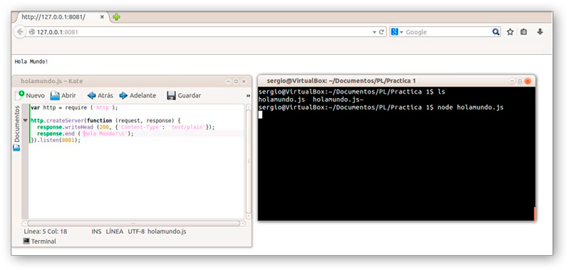

#Practica PL01
##Markdown y Node.JS
###Tutorial: como instalar [Node.JS] en Ubuntu (Linux)
[Node.JS]: http://nodejs.org/

Inicialmente accedemos a la terminal de Linux, para instalarlo via package manager, y escribimos:

>*curl -sL https://deb.nodesource.com/setup | sudo bash -*

Seguido de:

>*sudo apt-get install -y nodejs*

###Ejemplo de uso de [Node.JS]:

